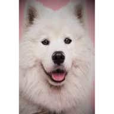

<h1 align="left">Pup4Sale</h1>  

## About
A small scale project developed using technologies I solely focus on. Pup4Sale is a simple fully responsive dog breeding website that helps users learn about a specific breed in addition to finding the puppy of their dreams. The application code repository remains private, however, snippets can be shown upon request.

## Web Framework
* Laravel: v5.8

## Design Pattern
* Model, View, Controller (MVC)

## Package Managers
* Composer: v1.10.13

## Technologies
Project was created using:
* HTML5 
* CSS3 
* Bootstrap: v4.0.0
* Javascript
* Jquery: v3.5.1
* PHP: v7.4.8
* MySQL: v5.0.2

## :information_source: Addtional Information 
<a href="./Pup4Sale.pdf" >Pup4Sale.pdf</a>

